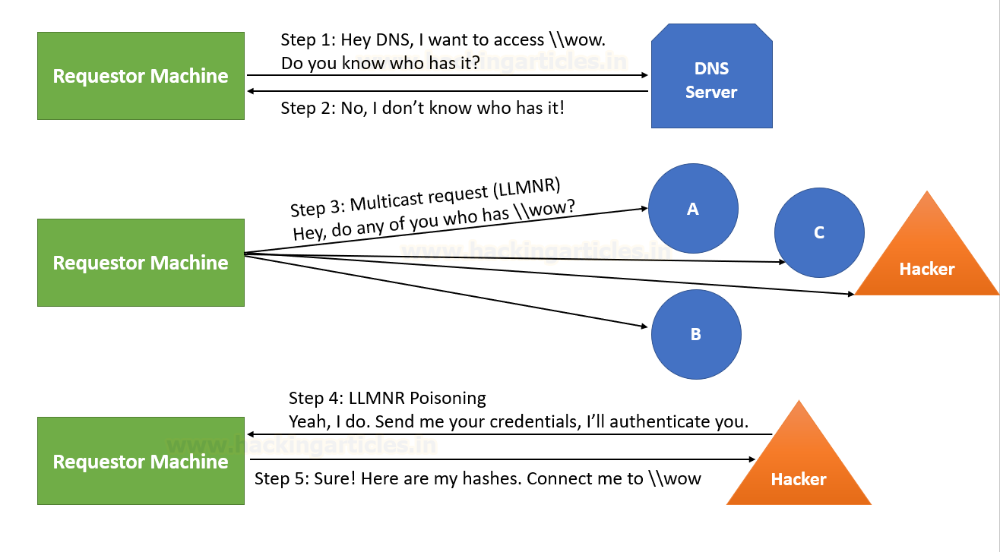

# Poisoning/Relay Attacks

## LLMNR/NBT-NS

The victim tries to connect to a shared drive `\\Drive` and it sends a request to the DNS server - the issue is if this share `\\Drive` doesn't exist the server replies back saying he can't connect to the share. The victim then multicasts his request to the entire network using LLMNR in case any user knows the route to the shared drive.

The attacker spoofs an authoritative source name by responding to this multicast request by a victim as if they know the identity of the shared drive a victim wants to connect with and in return requests its NTLM hash.

<figure><figcaption></figcaption></figure>

## SMB Relay attacks

Instead of cracking hashes gathered by Responder from our NTLM poisoning, we can instead relay those hashes to specific machines and potentially gain access

#### Requirements

* SMB signing must be disabled on the target
* Relayed user credentials must be a LOCAL admin on machine

Steps:

1: Run Responder

Go to `usr/share/responder` and turn off SMB and HTTP servers

2\) Run responder like before

3\) Set up your relay

`Python ntlmrelayx.py -tf targets.txt -smb2support`

Takes the relay and passes it to a target file, smb2 support to incorporate anything with SMB 2

4\) An event occurs (See section above)

5\) We relay the credentials captured to another machine and win

This attack dumps the SAM file which will contain the username's and hash's of any user that has logged onto the device (that is still cached at least) - **SAM is the shadw file of the windows world**


## DCHP

Dynamic Host Client Protocol (DHCP) is used to provide a host with its IP addreess, subnet mask, gateway etc. Windows uses multiple custom DHCP options like NetBIOS, WPAD etc. By poisoning the DHCP response an attacker would be able to help that victim pinpoint its own rogue server for any kind of authentication and in turn compromise the credential.

## IPV6 Relay (DNS takeover attacks via IPv6 )

IPV6 poisoning abuses the fact that Windows queries for an IPv6 address even in IPv4 environments. If you don’t use IPv6 internally the safest way to prevent is to block DHCPv6 traffic and incoming router advertisements in Windows Firewall via GPO

IPV6 is most likely turned on, but IPv4 is what is actually being utilized. Typically no one is actually doing DNS for IPV6.

So we take our attacker machine and spoof our DNS server, so the traffic is actually sent to us. We can use this to get authentication to the domain controller via LDAP or via SMB.

#### Installing mimt6

```bash
cd /opt/
git clone <repo>
pip2 install <requirements.txt>

```

#### Running the attack

```bash
mimt6 -d <domain>

#now we need to set our relay attack
# 6 for IPV6, LDAPS for ldap secure
# -l is for loot, 
ntlmrelayx.py -6 -t ldaps://<domain controller> -wh fakewpad.<domain>.local -l lootme

If we can grab an admin user in this time it will create a new user account for us,
```
